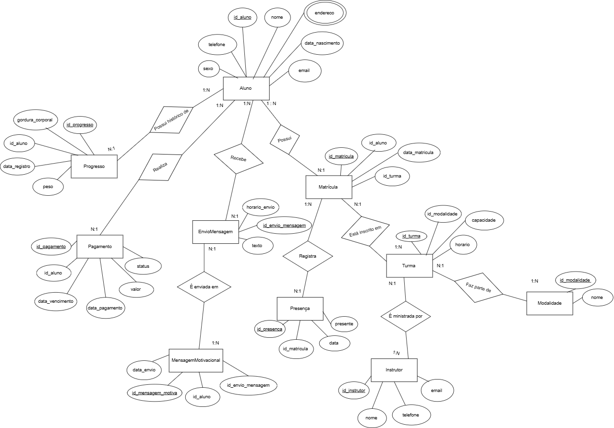

# Especificações do Projeto

Pré-requisitos: <a href="01-Documentação de Contexto.md"> Documentação de Contexto</a>

Definição do problema e ideia de solução a partir da perspectiva do usuário. 

## Usuários
| Tipo de Usuário   | Descrição | Responsabilidades |
|------------------|-----------|------------------|
| **xxx** | xxxxx | xxxxx |

### Exemplo

| Tipo de Usuário   | Descrição | Responsabilidades |
|------------------|-----------|------------------|
| **Administrador** | Gerencia a aplicação e os usuários. | Gerenciar usuários, configurar o sistema, acessar todos os relatórios. |
| **Funcionário** | Usa a aplicação para suas tarefas principais. | Criar e editar registros, visualizar relatórios. |

## Arquitetura e Tecnologias

Descreva brevemente a arquitetura definida para o projeto e as tecnologias a serem utilizadas. Sugere-se a criação de um diagrama de componentes da solução.

## Project Model Canvas

## Requisitos

As tabelas a seguir apresentam os requisitos funcionais e não funcionais que detalham o escopo do projeto. Para determinar a prioridade de requisitos, foi aplicada a técnica **MoSCoW** (Must Have, Should Have, Could Have, Won't Have). Essa técnica classifica os requisitos em níveis de importância para o sistema.

O sistema será dividido em duas partes:
- **Sistema Administrativo Web**: responsável pelo gerenciamento completo do sistema.
- **Aplicativo Mobile para Alunos**: permitirá aos alunos acompanharem seus treinos e progresso.

Para mais informações, consulte os microfundamentos **Fundamentos de Engenharia de Software** e **Engenharia de Requisitos de Software**.

### Requisitos Funcionais

| ID      | Descrição do Requisito                                         | Prioridade |
|---------|-----------------------------------------------------------------|------------|
| RF-001  | Permitir o cadastro e gerenciamento de turmas                   | ALTA       |
| RF-002  | Permitir o cadastro e gerenciamento de alunos                   | ALTA       |
| RF-003  | Implementar controle de presença diário                         | ALTA       |
| RF-004  | Registrar e acompanhar a evolução física dos alunos             | MÉDIA      |
| RF-005  | Disponibilizar dashboards de progresso individual               | MÉDIA      |
| RF-006  | Gerenciar pagamentos e inadimplências dos alunos                | ALTA       |
| RF-007  | Exibir alertas sobre pagamentos em atraso                       | ALTA       |
| RF-008  | Automatizar o envio de mensagens motivacionais                  | MÉDIA      |
| RF-009  | Gerenciar o controle de caixa                                   | MÉDIA      |
| RF-010  | Permitir que os alunos consultem seus treinos pelo aplicativo   | ALTA       |

### Requisitos Não Funcionais

| ID      | Descrição do Requisito                                          | Prioridade |
|---------|-----------------------------------------------------------------|------------|
| RNF-001 | O sistema deve ser responsivo para dispositivos móveis          | ALTA       |
| RNF-002 | O tempo de resposta das requisições deve ser inferior a 3 segundos | MÉDIA      |
| RNF-003 | O armazenamento dos dados deve garantir segurança e integridade | ALTA       |
| RNF-004 | A interface deve ser intuitiva e de fácil navegação             | MÉDIA      |
| RNF-005 | O sistema deve permitir exportação de relatórios em PDF         | BAIXA      |

## Restrições

O projeto está restrito pelos seguintes itens:

| ID  | Restrição                                              |
|-----|--------------------------------------------------------|
| 01  | O projeto deverá ser entregue até o final do semestre |
| 02  | O sistema deve ter um backend monolítico para mitigar custos de hospedagem |
| 03  | O banco de dados deve ser PostgreSQL                 |
| 04  | O sistema deve ser desenvolvido utilizando tecnologias web e mobile |

## Diagrama de Caso de Uso

## Projeto da Base de Dados

O projeto da base de dados corresponde à representação das entidades e relacionamentos identificadas no Modelo ER, no formato de tabelas, com colunas e chaves primárias/estrangeiras necessárias para representar corretamente as restrições de integridade.
 
Para mais informações, consulte o microfundamento "Modelagem de Dados".

 
